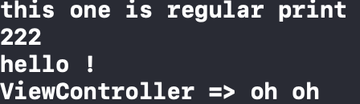

# Log Man
Want to disable logs for release build automatically? Want to print even easier? then use this helper.

With this simple helper your logs will automatically disable for build releasse and you can log smarter & simpler.

# Usage
1- add LogMan.swift to your project.

2- add this code to your 'appdelegate.swift' file 'didFinishLaunchingWithOptions' function:

        #if DEBUG
            LogMan.allowPrint = true
        #else
            LogMan.allowPrint = false
        #endif

3- Now all your default prints will be handled. but you can even print stuff easier by typing 'prt()' instead of 'print()' and if you want the name of your classes before your logs in console, just pass your class after your object like this:

    prt("Hello", self)
    
This way the output will be like this:

    ViewController => "Hello"
